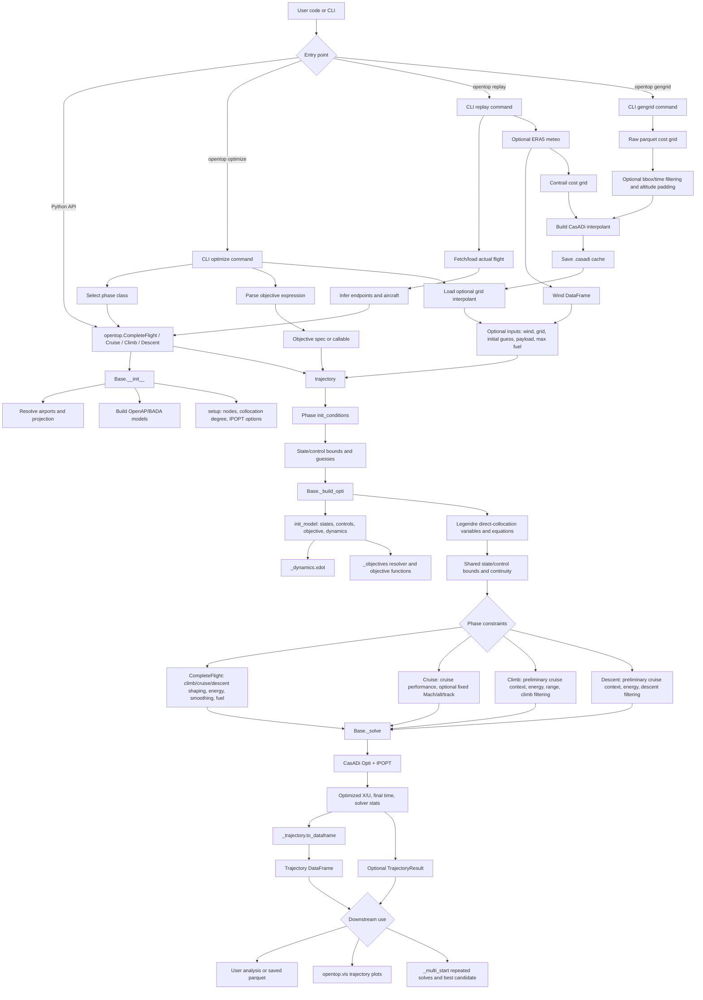

# OpenTOP High-Level Flow

This diagram summarizes the main execution paths in OpenTOP: the Python API,
the CLI, optional grid/wind/replay inputs, NLP construction, solving, and
trajectory reporting.

## Main Pipeline

The package API is exported from `opentop/__init__.py`. Users normally create
one of the phase optimizers and call `trajectory()`.

All phase classes inherit from `Base`. The phase method first calls
`init_conditions()` to set state and control bounds, endpoint constraints, and
initial guesses. It then calls `Base._build_opti()`, which creates the CasADi
Opti problem, symbolic state/control variables, free final time, objective
quadrature, collocation equations, and continuity constraints.

After the shared NLP scaffold is built, the phase class adds its own
constraints. `CompleteFlight` adds full-flight shaping and energy constraints,
`Cruise` adds cruise-specific and optional fixed-profile constraints, while
`Climb` and `Descent` can first run a preliminary cruise solve to obtain the
phase boundary altitude and Mach context.

Finally, `Base._solve()` configures IPOPT, solves the NLP, stores solver stats
and the physical objective value, and delegates numeric output conversion to
`_trajectory.to_dataframe()`.

## Data And Objective Inputs

Objectives can be built-in strings such as `fuel`, `time`, `ci:N`, climate
metrics, or `grid_cost`, or they can be user callables. `_objectives.py`
contains the pure objective implementations and registry. Grid-cost objectives
use CasADi interpolants from `tools.py`; bspline grid costs trigger exact
Hessian handling in the optimizer setup.

Wind enters through `Base.enable_wind()`, which fits a `tools.PolyWind` model.
That wind model is used inside `_dynamics.xdot()` so both numeric and symbolic
state derivatives include wind components.

## CLI And Replay

`opentop optimize` is a thin CLI wrapper around the same phase classes. It
parses weighted objective expressions, optionally loads a grid interpolant, runs
`trajectory()`, and prints solver and trajectory summaries.

`opentop gengrid` prepares raw parquet grids by slicing time/space, padding
altitudes, building a CasADi interpolant, and saving a reusable `.casadi` cache.

`opentop replay` fetches or loads an actual flight, optionally fetches ERA5
weather, enables wind, builds a contrail grid interpolant when needed, runs the
optimizer, and saves actual/optimized trajectories plus a plot.
